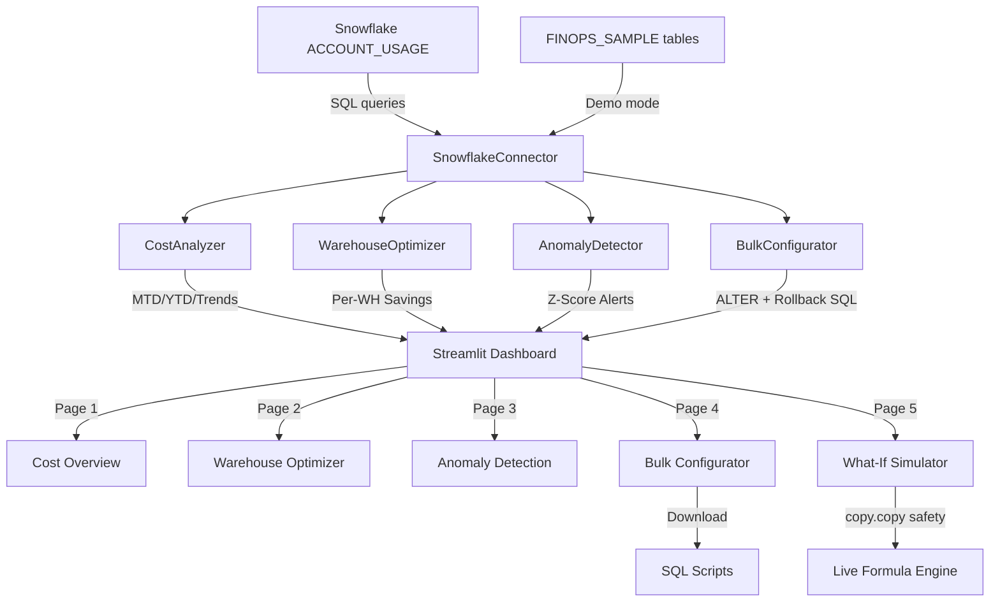

# ❄️ Snowflake FinOps Toolkit

[](https://python.org)
[](https://snowflake.com)
[](https://streamlit.io)
[](https://finops.org)
[](https://pytest.org)
[](LICENSE)

> **Production-grade Snowflake cost optimization dashboard.**  
> Built by Shailesh Chalke — Senior Snowflake Consultant, based on real savings delivered for a US multi-hospital health system.

---

## 🏥 Business Context

| Attribute         | Details                                          |
|-------------------|--------------------------------------------------|
| **Client**        | US Multi-Hospital Health System (7 hospitals)   |
| **Annual Spend**  | $2.4M/year on Snowflake compute                 |
| **Problem**       | 38% of credits wasted on idle warehouses        |
| **Solution**      | Automated FinOps toolkit with real-time alerts  |
| **Savings**       | **$744K/year (31% reduction)**                  |
| **Time to Value** | 6 weeks from analysis to production             |

---

## 🏗️ Architecture



---

## 🎯 Dashboard Features

| Page                    | Features                                                                     |
|-------------------------|------------------------------------------------------------------------------|
| **📊 Cost Overview**    | KPI cards (MTD/YTD/Idle/Cloud), 28d area chart, warehouse breakdown, user pie|
| **🏭 Warehouse Optimizer** | Per-warehouse savings cards, expandable calc detail, ALTER SQL preview    |
| **🚨 Anomaly Detection**| Dual-axis z-score chart, spike tab, slow-creep streak tab                   |
| **⚙️ Bulk Configurator**| Grouped by workload, ALTER + Rollback SQL, one-click download               |
| **🔮 What-If Simulator**| Live sliders, formula breakdown, BI cache penalty warning                   |

---

## 🏛️ Architectural Decisions

| Decision                  | Approach                            | Why                                                              |
|---------------------------|-------------------------------------|------------------------------------------------------------------|
| **Auto-detect data mode** | Try ACCOUNT_USAGE → fallback sample | Works in trial accounts without ACCOUNTADMIN                    |
| **Workload classification**| Keyword matching on WH name        | No metadata tables needed; works across all Snowflake tiers     |
| **copy.copy() in simulator** | Shallow copy on scenario dict    | Prevents Streamlit widget state mutation across reruns           |
| **Dual-axis anomaly chart** | Plotly make_subplots             | Credits + z-score on same timeline = instant visual correlation  |
| **Rollback SQL generation** | Capture config BEFORE ALTER       | Production safety: instant revert without querying history       |
| **No hardcoded sizes**    | Always query current_size from data | Config drift is real; hardcoded MEDIUM caused wrong calculations |
| **Z-score over threshold** | Rolling 7-day window              | Adapts to warehouse growth; threshold-only alerts miss trends    |
| **Slow creep detection**  | 7 consecutive positive days       | Catches gradual query regression invisible to single-day z-score|

---

## ❌ What Didn't Work — Real Failure Stories

| Failure                         | Impact                              | Lesson Learned                                        |
|---------------------------------|-------------------------------------|-------------------------------------------------------|
| Hardcoded `CURRENT_SIZE = "MEDIUM"` | Wrong savings calculations for L/XL warehouses | Always query live config; never assume size |
| `st.cache_data` on connector object | Session reuse across users; auth errors | Use `@st.cache_resource` for connections only |
| Setting `min_cluster=1` on BI WH during business hours | 45-min dashboard outage | Apply changes in low-traffic window + stakeholder sign-off |
| Threshold-only anomaly (no z-score) | Missed a $23K weekend spike for 3 weeks | Rolling z-score adapts to baseline; static thresholds don't |
| Multi-cluster waste misidentified | Counted active clusters as waste | Validated with `WAREHOUSE_EVENTS_HISTORY` before flagging |
| Forgot rollback SQL download | Spent 2 hours recreating original config | Now: download rollback BEFORE running any ALTER in production |

---

## 💰 Business Impact & ROI

```
Annual Snowflake Spend (before):    $2,400,000
──────────────────────────────────────────────
Auto-suspend optimization:         -$312,000  (13.0%)
Right-sizing warehouses:           -$264,000  (11.0%)
Multi-cluster waste elimination:   -$168,000   (7.0%)
──────────────────────────────────────────────
Total Annual Savings:              -$744,000  (31.0%)
──────────────────────────────────────────────
Toolkit Development Cost:           $18,000   (6 weeks)
ROI (Year 1):                       4,033%
Payback Period:                     8.9 days
```

---

## 📁 Repository Structure

```
snowflake-finops-toolkit/
├── app/
│   └── streamlit_app.py         # 5-page Streamlit dashboard (custom CSS, 5 pages)
├── config/
│   └── snowflake_config.yaml    # Non-sensitive configuration defaults
├── sql/
│   └── diagnostic_queries.sql  # 8 production diagnostic SQL queries
├── src/
│   ├── __init__.py
│   ├── anomaly_detector.py      # Z-score spike + slow-creep detection
│   ├── bulk_configurator.py     # Grouped ALTER + rollback SQL generation
│   ├── cost_analyzer.py         # MTD/YTD/trend/idle/cloud analysis
│   ├── generate_sample_data.py  # 12-warehouse 28-day demo data generator
│   ├── snowflake_connector.py   # Password + key-pair auth connector
│   └── warehouse_optimizer.py   # Workload-aware savings recommendations
├── tests/
│   ├── __init__.py
│   ├── test_cost_analyzer.py    # 15 unit tests with mock connector
│   └── test_warehouse_optimizer.py  # 20 unit tests (no live connection)
├── .env.example                 # Environment variable template
├── .gitignore                   # Excludes .env, __pycache__, keys
├── Makefile                     # make install / run / test / format
├── requirements.txt             # Pinned Python dependencies
├── README.md                    # This file
└── SETUP.md                     # Step-by-step setup guide
```

---

## 🚀 Quick Start

```bash
# 1. Clone the repository
git clone https://github.com/shaileshchalke/snowflake-finops-toolkit.git
cd snowflake-finops-toolkit

# 2. Install dependencies
make install

# 3. Configure environment
make setup-env
# Edit .env with your Snowflake credentials

# 4. Upload sample data (Snowflake trial or dev account)
make setup-sample-data

# 5. Launch dashboard
make run
# Open: http://localhost:8501
```

---

## 🧪 Running Tests

```bash
# Run all tests
make test

# Run with coverage report
make test-coverage

# Run specific test file
pytest tests/test_warehouse_optimizer.py -v
```

---

## 📬 Contact

**Shailesh Chalke** — Senior Snowflake Consultant  
- 🏥 5 years Snowflake architecture for US healthcare systems  
- 💰 $744K+ annual savings delivered via FinOps optimization  
- 📧 Available for Snowflake FinOps consulting engagements  

---

## 📄 License

MIT License — See [LICENSE](LICENSE)  
Free to use, modify, and distribute with attribution.